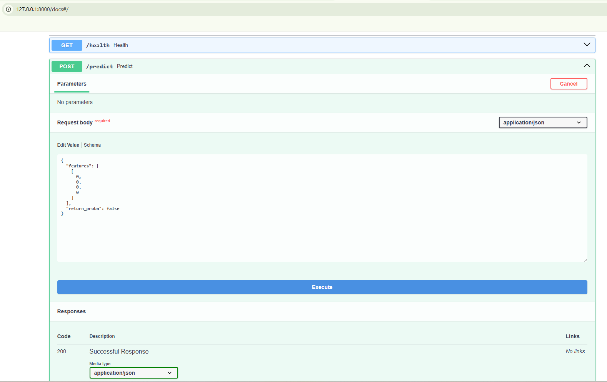
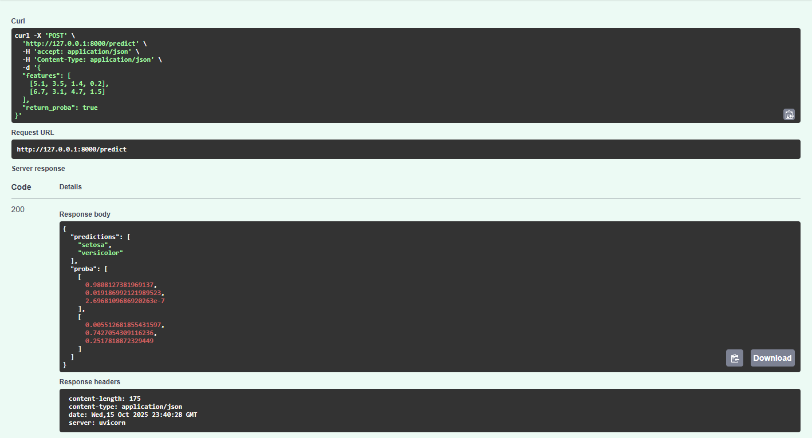
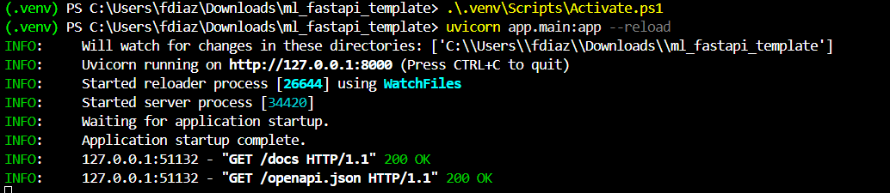

# Informe – Trabajo Final (FastAPI + ML)

## Integrantes
- Frank Díaz
- Braian Escobar

## 1. Datos
- Fuente: Iris (scikit-learn)
- Variables: 4 numéricas (sepal_length, sepal_width, petal_length, petal_width)
- Target: especie (`setosa`, `versicolor`, `virginica`)

## 2. Preparación
- Sin nulos en Iris. Normalización con `StandardScaler` dentro del pipeline.

## 3. Modelo
- Pipeline: `StandardScaler` + `LogisticRegression` (multiclase, softmax)
- Justificación: baseline simple, reproducible y rápido para demo y despliegue.

## 4. Validación y Métricas (test)
- Split: 80/20, `random_state=42`, `stratify=y`
- **Accuracy**: __COMPLETAR__  
- (Ver `evidencias/metricas_test.txt` y `evidencias/matriz_confusion.png`)

## 5. API FastAPI
- Endpoints: `GET /health`, `POST /predict`
- Entrada: lista de filas, cada una con 4 floats (orden del entrenamiento)
- Salida: `predictions` y (opcional) `proba`
- Evidencias: ver `evidencias/api_docs.png` y `evidencias/predict_ok.png`

## 6. Decisiones y Supuestos
- Consistencia del orden de features entre entrenamiento e inferencia
- Mapeo de índices a texto con `target_names` guardado en el artefacto

## 7. Limitaciones y Próximos Pasos
- Dataset demo; para caso real: reemplazar datos y objetivo, validar con métricas acordes
- Explorar otros modelos (RF/XGBoost), validación k-fold, tuning

## 8. Repositorio
- Público: https://github.com/fdiaz-droid/Trabajo_final_CComting
- Contiene código, `model.pkl`, `requirements.txt`, `README.md` y evidencias

## Evidencias

<!-- opcional -->

